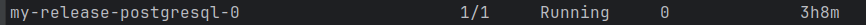
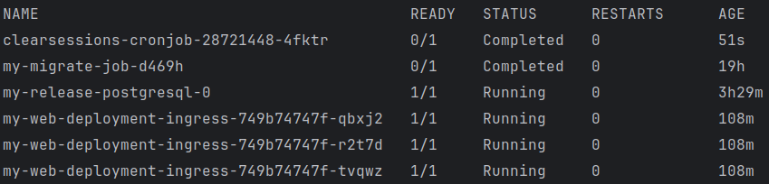

# Django Site

Докеризированный сайт на Django для экспериментов с Kubernetes.

Внутри контейнера Django приложение запускается с помощью Nginx Unit, не путать с Nginx. Сервер Nginx Unit выполняет
сразу две функции: как веб-сервер он раздаёт файлы статики и медиа, а в роли сервера-приложений он запускает Python и
Django. Таким образом Nginx Unit заменяет собой связку из двух сервисов Nginx и
Gunicorn/uWSGI. [Подробнее про Nginx Unit](https://unit.nginx.org/).

## Как подготовить окружение к локальной разработке

Код в репозитории полностью докеризирован, поэтому для запуска приложения вам понадобится Docker. Инструкции по его
установке ищите на официальных сайтах:

- [Get Started with Docker](https://www.docker.com/get-started/)

Вместе со свежей версией Docker к вам на компьютер автоматически будет установлен Docker Compose. Дальнейшие инструкции
будут его активно использовать.

## Установка Minikube, VirtualBox и kubectl

- Документацию по [minikube](https://minikube.sigs.k8s.io/docs/)
- Документация по [kubectl](https://kubernetes.io/ru/docs/tasks/tools/install-kubectl/)
- Документация по [VirtualBox](https://www.virtualbox.org/)
-

## Запуск minikube

```shell
minikube start
```

## Получить IP адрес minikube

```shell
minikube ip
```

Для изменения доступа к minikube по домену нужно следовать по
этой [инструкции](https://help.reg.ru/support/dns-servery-i-nastroyka-zony/rabota-s-dns-serverami/fayl-hosts-gde-nakhoditsya-i-kak-yego-izmenit)

## Как упаковать приложение для minikube

Документация для использования терминала внутри minikube можете прочитать
по [ссылке](https://minikube.sigs.k8s.io/docs/handbook/pushing/)

После того как зашли внутри minikube, соберите проект в докер контейнер:

```shell
$ docker compose build
```

Запуск локального докер регистра:

```shell
docker run -d -p 5000:5000 --name registry registry:2
```

Добавить тэг контейнера Django приложение для локального регистра:

```shell
docker tag django_app:latest localhost:5000/django_app:latest
```

Загрузить контейнер Django приложение в локальный регистр:

```shell
docker push localhost:5000/django_app:latest
```

Теперь наши сервисы в kubernetes могут подтягивать контейнер Django с локального регистра для дальнейшей работы

## Установка базы данных через Helm

```shell
sudo snap install helm --classic
```

Установить и запустить pod с базой данных внутри minikube

```shell
helm install my-release oci://registry-1.docker.io/bitnamicharts/postgresql
```

Создать Базу данных внутри postgres pod:

```shell
kubectl get pods
```

Находим pod postgres:


Получить IP адрес пода:

```shell
kubectl describe pods ${pod_name}
```

Зайти в терминала запущеного пода:

```shell
kubectl exec -it ${pod_name} sh
```

Создать базу данных внутри пода можете посмотреть
по [ссылке](https://www.atlassian.com/data/admin/create-a-user-with-psql)

## Создание секрета для minikube

Создаем .env файл и копируем содержимое из .env.example

* SECRET_KEY = секретный ключ проекта. Он отвечает за шифрование на сайте. Например, им зашифрованы все пароли на вашем
  сайте.
* DEBUG — дебаг-режим. Поставьте False.
* ALLOWED_HOSTS — Доступные IP адреса и домены для Django, туда добавляем домен которого настроили внутри hosts
* DATABASE_URL - ссылка для доступа в базу данных
*
    * DB_USER - пользователь имеющий доступ к базе данных
*
    * USER_PASSWORD - пароль пользователя
*
    * DB_HOST - IP адрес запущенной базы данных
*
    * DB_NAME - Имя базы данных

Создаем secret:

```shell
kubectl create secret generic django-env --from-env-file=.env
```

# Запуск Проекта внутри minikube:

Команда для запуска deployment, запускает 3 реплики контейнера Django проекта с названием проекта my-ingress

```shell
kubectl apply -f deployment.yaml
```

Команда запускает service, под одним проектом my-ingress. Service нужен для открытия портов и load balancing.

```shell
kubectl apply -f service.yaml
```

Команда запускает ingress, под сервисом my-web-ingress. Позволяет перенаправлять HTTP запросы с star-burger.test к порту
80 с префиксом /

```shell
kubectl apply -f ingress.yaml
```

Команда запускает job, который будет выполнять команду миграции.

```shell
kubectl apply -f job.yaml
```

Команда запускает cronjob, для удаление устаревших сессий.

```shell
kubectl apply -f cronjob.yaml
```

После запуска проверим состояние подов:

```shell
kubectl get pods
```

В терминале должно выйти следующая запись:


* clearsessions-cronjob - Cronjob для периодичского запуска Job для удаления устаревших сессий
*
    * schedule: "0 0 * * 0" - ознанчает что Job будет запускать команду каждый день в 00:00
* my-migrate-job - Job для применения миграции в базу данных
* my-release-postgresql-0 - Pod базы данных
* my-web-deployment-ingress - Podы в которых запущены наши Django контейнеры
*
    * Ingress - позволяет перенаправлять запросы с star-burger.test между тремя репликами нашего пода

# Как задеплоить на Yandex Cloud

- Создаем кластер в Yandex Cloud
- Создаем namespace
- Создаем Service указывая порты для внутреннего пода и NodePort привязанный к домену